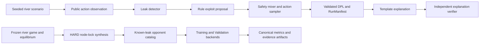

# poker-xai

**Experimental Python research framework for auditable poker decision provenance,
small-game and river solving, synthetic opponent leaks, and explanation checks.**

`poker-xai` studies whether a simulated policy deviation can be traced from a
public observation through leak detection, an exploit proposal, safety mixing,
action sampling, and a structured explanation. The project combines a Decision
Provenance Log (DPL), finite-game CFR tooling, a limited river subgame solver,
HARD node-lock opponent synthesis, deterministic explanation generation, and
artifact-oriented Training/Validation experiments.

> **Status: experimental functional prototype.** The main research components
> exist and the documented simulation runs locally, but the current Gate B v2
> work is not CI-clean, public APIs are not stable, and the results have not been
> independently validated. There are no releases.

This is not a real-time poker bot. It has no screen scraping, poker-site API,
live table input, or real-money automation.

## Why this project exists

An explanation of an adaptive poker decision can sound plausible while citing
the wrong observation, policy change, or expected-value calculation. This
project creates synthetic settings where an opponent leak is known by
construction, records the full decision path in a validated DPL, and checks a
generated explanation against that record. The primary research target is
explanation faithfulness and provenance, not maximum poker profit.

## What is implemented

| Area | Current implementation | Status |
| --- | --- | --- |
| Provenance contracts | Pydantic contracts for DPL v1/v2, Reason Ontology, `StrategyTable`, and `RunManifest`; JSON Schema export | Implemented |
| River primitives | Cards, combos, weighted ranges, seven-card evaluation, exact range-vs-range showdown EV, and a seeded Monte Carlo estimator | Implemented |
| Simulation pipeline | Seeded one-decision river scenarios, public action tracking, action-rate leak detection, rule exploits, safety mixing, action selection, and JSONL/manifest output | Implemented with a stub baseline and opponent in the quickstart |
| Game solving | Exact profile EV and best response for finite two-player zero-sum games; vanilla CFR, CFR+, convergence metrics, analytic toy games, and a single-bet river tree | Implemented for the documented small games and river abstraction |
| Node locking | HARD node-lock projection, EV deltas, worst-case best response, and sensitivity reports | Implemented; SOFT locks are not implemented |
| Explanations | Deterministic five-stage template documents with numeric source paths and an independently coded verifier | Implemented; no LLM generation |
| Opponent models | Frozen equilibrium artifacts, canonical Training/Validation catalogs, deterministic HARD node-lock synthesis, and ground-truth leak extraction | Implemented for repository fixtures |
| Phase 6 evaluation | Closed-world contracts, deterministic Training/Validation plans and backends, exact-EV/calibration artifacts, freeze manifests, and Gate B trust-chain code | Experimental; Gate B v2 is work in progress |

The evidence and important qualifications behind these statements are in
[Implementation status](docs/implementation-status.md).

## What this project does not do

- It does not play poker, observe live opponents, connect to poker sites, or
  automate betting.
- It is not a full no-limit hold'em GTO solver. The implemented river solver is a
  restricted heads-up, two-player zero-sum subgame with a small action tree.
- It does not implement preflop/flop/turn solving, multiplayer solving, prize EV,
  ICM, Future Game Simulation (FGS), tournament payouts, or repeated-game
  equilibrium analysis.
- It does not claim production readiness, security certification, formal
  verification, mathematical proof of convergence, or independent validation.
- It does not use an LLM, GPU, model provider, external solver, commercial poker
  data, or paid API in the documented workflow.
- It does not implement SOFT node locks. Several Phase 6 and Gate B surfaces are
  internal experiment interfaces rather than supported end-user commands.

## Current workflow



The first row is the smallest runnable demonstration. The second row represents
the larger repository-fixture evaluation path. Gate B adds pinned filesystem
identities, human approval records, execution limits, and fail-closed artifact
handling around later evaluation stages; it is not part of the quickstart.

## Requirements

- Python 3.12 or newer (the package metadata and CI currently target 3.12)
- `pip` and a virtual environment
- Runtime packages: Pydantic 2 and PyYAML
- Development checks: pytest, Ruff, and jsonschema (`.[dev]`)
- Git is optional at runtime but used to record the current commit in manifests

The simulation, solver, and explanation components require neither a GPU nor
network access after installation. Ubuntu is the CI platform and the documented
quickstart was also exercised on Windows. macOS is not verified. Gate B v2 has a
Windows-specific execution surface that requires fixed-drive volume/file
identities; other Gate B code also contains POSIX adapters, but cross-platform
behavior is not currently CI-clean.

## Quickstart

Clone and create an isolated Python 3.12 environment:

```bash
git clone https://github.com/guriguri215-lang/DPL_poker_ai.git
cd DPL_poker_ai
python -m venv .venv
```

The repository is currently private, so cloning requires authenticated GitHub
access unless its owner later changes the visibility.

Activate it on POSIX:

```bash
. .venv/bin/activate
```

Or on Windows PowerShell:

```powershell
.\.venv\Scripts\Activate.ps1
```

Install the package and development dependencies, then run the five-decision
public fixture:

```bash
python -m pip install --upgrade pip
python -m pip install -e ".[dev]"
python cli/run_session.py --seed 20260704 --hands 5 --leaky-fixture --out-dir experiments_output/quickstart
```

Expected summary:

```text
session S20260704: 5 decisions validated against DPL v2
detected_leaks=5
mixed_decisions=5
wrote experiments_output/quickstart/S20260704.dpl.jsonl
wrote experiments_output/quickstart/S20260704.manifest.json
```

Windows prints the two output paths with backslashes instead of forward slashes.

The JSONL file contains one validated decision record per line. The manifest
records the seed, schema and ontology versions, package/Python versions, command
arguments, and Git commit when Git is available. `--leaky-fixture` is deliberately synthetic
and is intended only to make the leak/exploit/mix path visible.

Export the public schemas with:

```bash
python cli/export_schemas.py --out-dir docs/schemas
```

The Pydantic models remain the canonical validators because JSON Schema cannot
express every cross-field invariant used by the project.

## Validation and tests

Run the same checks declared by CI:

```bash
python -m ruff check .
python -m ruff format --check .
python -m pytest
```

The current branch collects 1,624 tests, but test count is not a quality claim.
Tests cover schema invariants, analytic toy games, solver consistency,
node-lock behavior, deterministic sampling, explanation verification, catalog
separation, and Phase 6 artifact contracts. They do not establish real-world
poker performance, large-game convergence, security, or explanation validity
with human subjects.

As of 2026-08-03, the current WIP branch and the latest `main` CI run are not
clean. The WIP branch has Ruff/format failures and one Gate B v2 Windows
lifecycle test that still fails in a clean environment; the latest `main` CI run
fails Linux tests that use Windows-root golden fixtures.
See the exact snapshot in [Implementation status](docs/implementation-status.md).

## Representative use cases

- Generate a DPL and manifest for a deterministic simulated river decision.
- Test whether a template explanation cites the same observations, reason IDs,
  policies, and EV fields as the underlying DPL.
- Validate CFR/CFR+ implementations against analytic toy games and an independent
  best-response evaluator.
- Synthesize a repository-fixture opponent with a known HARD node-locked leak and
  measure a detector or rule exploit against that ground truth.
- Experiment with deterministic Training/Validation artifact and provenance
  contracts. This surface is experimental and not a general-purpose benchmark.

## Limitations

- **Game scope:** heads-up finite games and a restricted river abstraction, not
  complete no-limit hold'em.
- **Algorithms:** CFR/CFR+ are approximate iterative methods. Convergence evidence
  applies only to the tested games, iteration counts, and tolerances.
- **Baseline:** the quickstart's packaged `poker_ai` baseline ends in `-stub` and
  is hand-authored, not an equilibrium strategy.
- **Opponent data:** Training and Validation opponents are synthetic repository
  fixtures derived from frozen artifacts. Test access is intentionally separated.
- **Scale:** Phase 6 plans can contain thousands of deterministic sessions and the
  full test suite is slow; no scalability benchmark is published.
- **Reproducibility:** seeds, hashes, versions, and manifests are recorded, but
  complete reproduction still depends on OS/filesystem semantics and the exact
  source/dependency state. The quickstart CLI records the commit but does not
  currently detect a dirty worktree, so its default `git_dirty` value can be
  misleading.
- **Security and privacy:** the project is not security audited. Gate B validates
  paths and identities, but experiment artifacts can contain provenance and local
  path information and should be reviewed before sharing.
- **API stability:** version `0.0.0`, no release tags, and active internal contract
  development mean breaking changes are possible.
- **Interface:** no GUI, web service, notebook tutorial, or stable high-level
  application API is provided.

## Project structure

| Path | Purpose |
| --- | --- |
| `src/poker_core/` | Shared cards, ranges, EV primitives, DPL contracts, schemas, and manifests |
| `src/poker_ai/` | Simulated observation-to-decision pipeline and stub quickstart assets |
| `src/poker_solver/` | Finite-game evaluation, best response, CFR/CFR+, river solving, and node locking |
| `src/opponents/` | Frozen equilibrium loading, canonical catalogs, synthesis, and ground truth |
| `src/explanation/` | Structured template explanations and independent verification |
| `src/phase6/` | Experimental Training/Validation/Gate B contracts and execution surfaces |
| `configs/opponents/` | Physically separated synthetic Training, Validation, and Test fixtures |
| `cli/` | Research and artifact-generation entry points |
| `tests/` | Unit, invariant, analytic, integration, and artifact-contract tests |

## Documentation

- [Documentation index](docs/README.md)
- [Implementation status and evidence](docs/implementation-status.md)
- [Core contracts](src/poker_core/README.md)
- [Simulation pipeline](src/poker_ai/README.md)
- [Solver scope](src/poker_solver/README.md)
- [Opponent synthesis](src/opponents/README.md)
- [Explanation contracts](src/explanation/README.md)

Generated schemas under `docs/schemas/` are intentionally gitignored and can be
recreated with the export command above.

## Related work and differentiation

Projects such as [RLCard](https://github.com/datamllab/rlcard) and
[PokerRL](https://github.com/EricSteinberger/PokerRL) provide broader card-game
or reinforcement-learning environments. [PokerKit](https://github.com/uoftcprg/pokerkit)
focuses on comprehensive poker simulation and evaluation, while
[postflop-solver](https://github.com/b-inary/postflop-solver) focuses on an
efficient postflop solving library. `poker-xai` is narrower: its distinctive
surface is the join between a known synthetic opponent leak, a structured DPL,
and an explanation whose citations and numbers can be checked against that log.
Its solver exists to support and test that research path, not to compete on
full-game coverage or solving performance.

## Roadmap

- [x] DPL, Reason Ontology, StrategyTable, and RunManifest contracts
- [x] Exact river showdown EV and small-game CFR/CFR+ verification fixtures
- [x] HARD node-lock synthesis and deterministic template explanation checks
- [x] Repository-fixture Training/Validation contracts and backends
- [ ] Restore clean Ruff, format, and full-test results for Gate B v2
- [ ] Replace or explicitly retire the stub quickstart baseline
- [ ] Publish a smaller supported Phase 6 example with measured runtime/resources
- [ ] Add independent scientific validation and a versioned release

No external contribution process is currently documented. Until one is added,
open an issue to discuss a proposed change before investing in a large patch.

## Responsible use

Use this repository for offline simulation and research. Do not adapt it to gain
an unfair advantage in real-money play or to violate a poker platform's terms.
The absence of live-play integrations is a deliberate boundary.

## License

Apache License 2.0. See [LICENSE](LICENSE).
